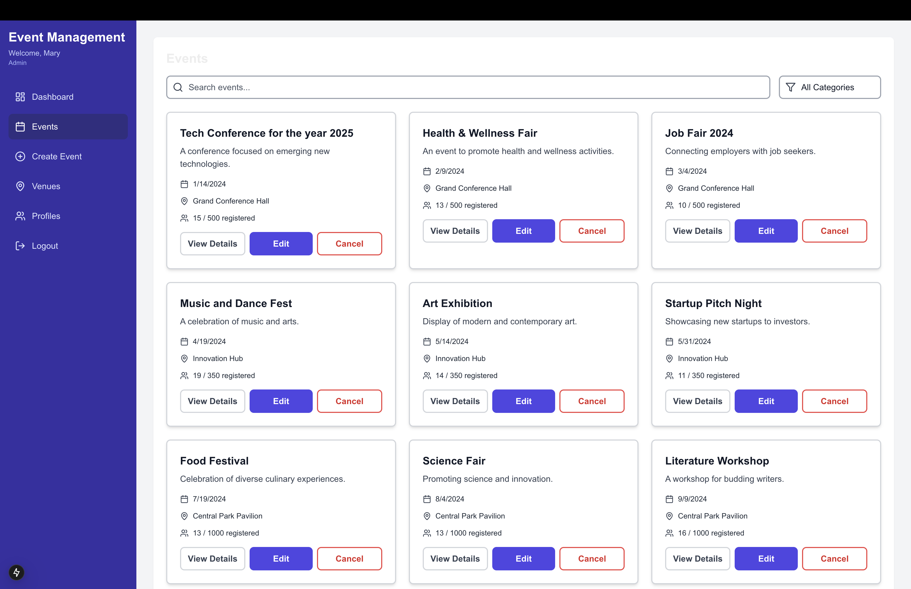
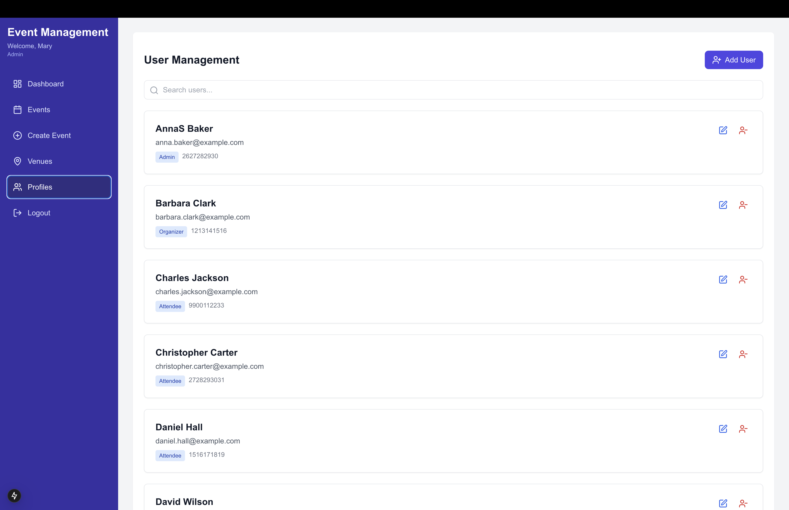
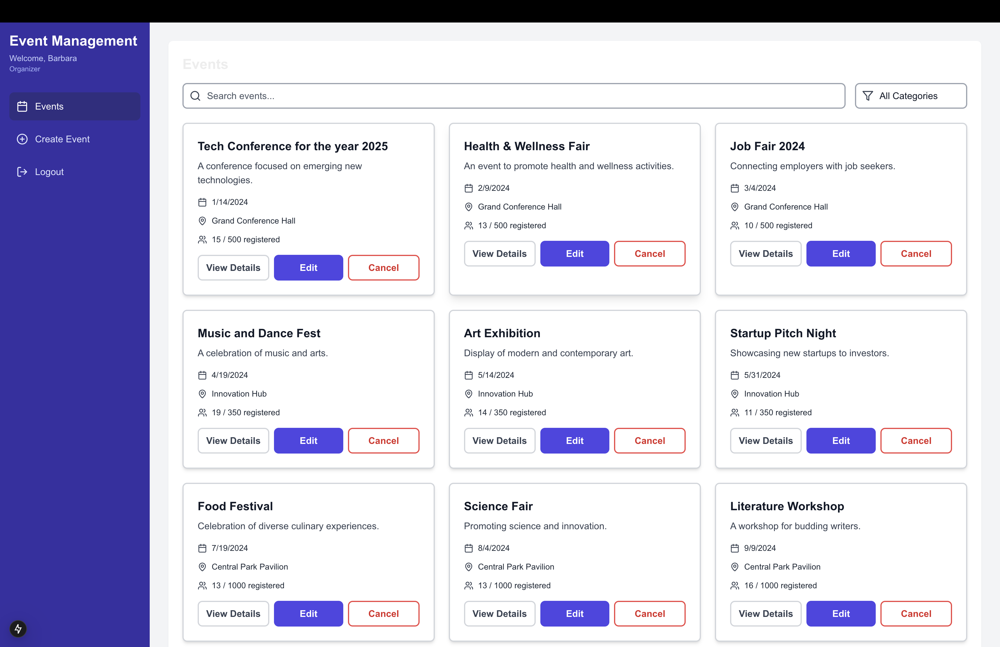
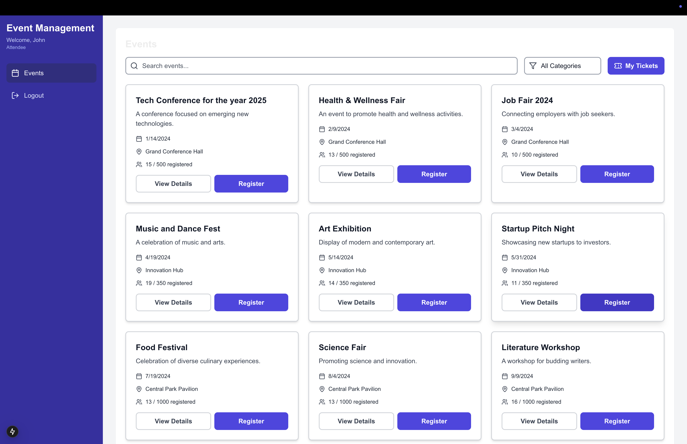
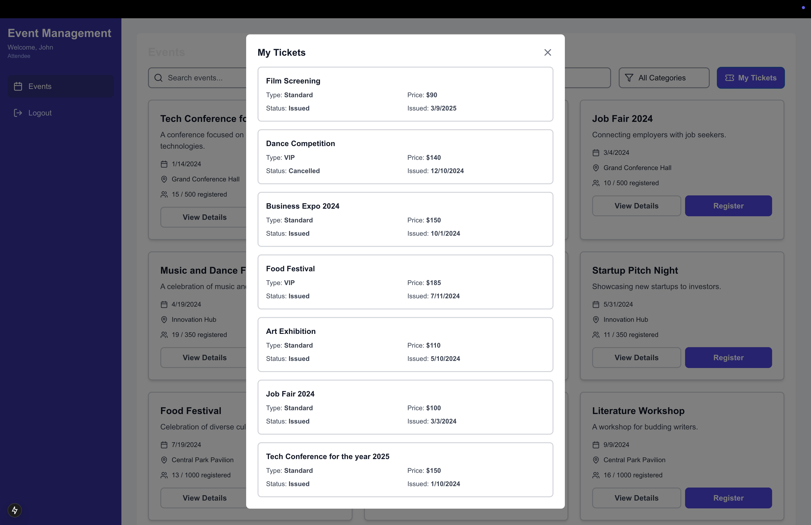
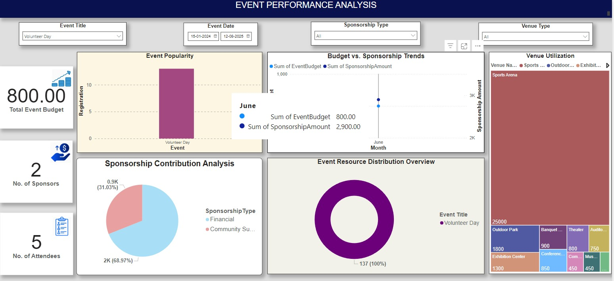

# University Event Management System

<div align="center">

[](https://nextjs.org/)
[](https://reactjs.org/)
[](https://www.typescriptlang.org/)
[](https://tailwindcss.com/)
[](https://www.microsoft.com/sql-server)

[](https://opensource.org/licenses/MIT)
[](http://makeapullrequest.com)
[](https://github.com/yourusername/university-event-management/graphs/commit-activity)

</div>

## 📋 Overview

A comprehensive full-stack web application built with Next.js for managing university events, venues, and attendees. The system provides different roles (Admin, Organizer, and Attendee) with specific functionalities to handle event creation, registration, and management.

## 📸 Screenshots

<details>
<summary>Click to view screenshots</summary>

### Login Screen

*Secure login interface with email and password authentication.*

### Event Dashboard (Admin View)

*Admin dashboard displaying all events with options to view details, edit, or cancel events.*

### User Management

*Admin interface for managing users with different roles (Admin, Organizer, Attendee).*

### Event Dashboard (Organizer View)

*Organizer's dashboard showcasing the events they manage.*

### Event Dashboard (Attendee View)

*Attendee's event dashboard with options to register or view event details.*

### My Tickets

*Attendee's ticket overview showing registered events, statuses, and types.*

### Event Performance Dashboard (Power BI)

*Comprehensive Power BI dashboard for visualizing event performance, sponsorship trends, and venue utilization.*

</details>

## ✨ Features

### User Management
- Role-based authentication (Admin, Organizer, Attendee).
- Secure login system.
- User profile management.
- Password protection.

### Event Management
- Create, edit, and delete events.
- Event categorization.
- Capacity management.
- Date and venue scheduling.
- Event registration tracking.

### Venue Management
- Venue creation and editing.
- Capacity tracking.
- Venue type categorization.
- Location management.

### Dashboard & Analytics
- Admin dashboard with key metrics.
- Event statistics.
- Registration tracking.
- Revenue monitoring.
- **Power BI integration** for advanced data visualization.

### Search & Filtering
- Event search functionality.
- Category-based filtering.
- Venue search.
- User search for admins.

## 🛠️ Technology Stack

### Frontend
- Next.js 13+ (App Router)
- React 18
- TypeScript
- Tailwind CSS
- Lucide Icons (v0.263.1)
- shadcn/ui components
- Recharts for data visualization

### Backend
- Next.js API Routes
- MS SQL Server
- mssql package for database connection

### Core Dependencies
```json
{
  "dependencies": {
    "@radix-ui/react-alert-dialog": "^1.0.0",
    "@radix-ui/react-icons": "^1.0.0",
    "class-variance-authority": "^0.7.0",
    "clsx": "^2.0.0",
    "geist": "^1.0.0",
    "lodash": "^4.17.21",
    "lucide-react": "^0.263.1",
    "mathjs": "^12.0.0",
    "mssql": "^10.0.0",
    "next": "14.0.0",
    "papaparse": "^5.4.0",
    "react": "^18",
    "react-dom": "^18",
    "recharts": "^2.10.0",
    "xlsx": "^0.18.0"
  }
}
```

### Development Dependencies
```json
{
  "devDependencies": {
    "@types/lodash": "^4.14.0",
    "@types/node": "^20",
    "@types/papaparse": "^5.3.0",
    "@types/react": "^18",
    "@types/react-dom": "^18",
    "autoprefixer": "^10.0.1",
    "eslint": "^8",
    "eslint-config-next": "14.0.0",
    "postcss": "^8",
    "tailwindcss": "^3.3.0",
    "typescript": "^5"
  }
}
```

### Features
- Server-side rendering.
- API route protection.
- Form validation.
- Error handling.
- Responsive design.
- CSV parsing with Papaparse.
- Excel file handling with SheetJS.
- Mathematical operations with MathJS.
- Data manipulation with Lodash.
- Chart visualization with Recharts.
- UI components from shadcn/ui library.
- Modern typography with Geist font.
- Icon system using Lucide React.

## 🚀 Getting Started

### Prerequisites
- Node.js 16.8 or later
- MS SQL Server
- npm or yarn package manager

### Installation

1. Clone the repository
```bash
git clone https://github.com/yourusername/university-event-management.git
cd university-event-management
```

2. Install dependencies
```bash
npm install
# or
yarn install
```

3. Configure environment variables
Create a `.env.local` file in the root directory with the following variables:
```env
DB_SERVER=your_server_name
DB_NAME=UniversityEventManagementSystem
DB_USER=your_username
DB_PASSWORD=your_password
```

4. Database Setup

#### Prerequisites
- MS SQL Server installed and running
- SQL Server Management Studio (SSMS) or Azure Data Studio for script execution
- SQL Server Configuration Manager to enable TCP/IP protocol

#### Database Configuration Steps

1. Enable SQL Server Network Protocols
   - Open SQL Server Configuration Manager
   - Navigate to SQL Server Network Configuration > Protocols for MSSQL
   - Enable TCP/IP protocol
   - Restart SQL Server service

2. Create and Set Up Database
   - Open SSMS or Azure Data Studio
   - Connect to your SQL Server instance
   - Open the `/lib/sql/setup.sql` script
   - Execute the script to:
     - Create the database
     - Create all required tables
     - Insert initial sample data

3. Configure SQL Server Authentication
   - Ensure SQL Server Authentication is enabled
   - Create a dedicated database user with appropriate permissions
   - Update the following permissions for your database user:
     ```sql
     USE UniversityEventManagementSystem;
     GRANT SELECT, INSERT, UPDATE, DELETE ON SCHEMA::dbo TO your_username;
     ```

4. Test Database Connection
   - Update your `.env.local` file with the correct credentials
   - Run the application in development mode
   - Check the console for successful database connection message

5. Start the development server
```bash
npm run dev
# or
yarn dev
```

6. Open [http://localhost:3000](http://localhost:3000) in your browser

## 📁 Project Structure

```
├── app/
│   ├── api/          # API routes
│   ├── components/   # React components
│   ├── features/     # Feature components
│   └── lib/          # Utility functions
├── public/           # Static files
└── styles/          # Global styles
```

## 🔌 API Endpoints

### Authentication
- `POST /api/auth` - User login

### Events
- `GET /api/events` - Get all events
- `POST /api/events/create` - Create new event
- `PUT /api/events/[id]` - Update event
- `DELETE /api/events/[id]` - Delete event
- `POST /api/events/register` - Register for event

### Venues
- `GET /api/venues` - Get all venues
- `POST /api/venues/create` - Create new venue
- `PUT /api/venues/[id]` - Update venue
- `DELETE /api/venues/[id]` - Delete venue

### Users
- `GET /api/users` - Get all users
- `POST /api/users/create` - Create new user
- `PUT /api/users/[id]` - Update user
- `DELETE /api/users/[id]` - Delete user

## 🤝 Contributing

[](https://github.com/yourusername/university-event-management/graphs/contributors)
[](https://github.com/yourusername/university-event-management/issues)
[](https://github.com/yourusername/university-event-management/pulls)

1. Fork the repository
2. Create your feature branch (`git checkout -b feature/AmazingFeature`)
3. Commit your changes (`git commit -m 'Add some AmazingFeature'`)
4. Push to the branch (`git push origin feature/AmazingFeature`)
5. Open a Pull Request

## 📝 License

[](https://opensource.org/licenses/MIT)

This project is licensed under the MIT License - see the [LICENSE](LICENSE) file for details

## 🙏 Acknowledgments

[](https://tailwindcss.com)
[](https://ui.shadcn.com)
[](https://lucide.dev)

Special thanks to:
- Tailwind CSS for the styling system.
- shadcn/ui for the component library.
- Lucide for the icon set.
- Power BI for advanced event performance analytics.
